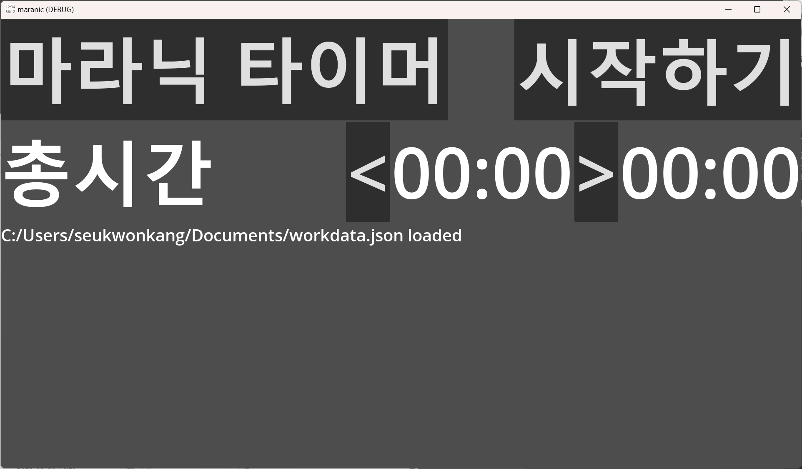
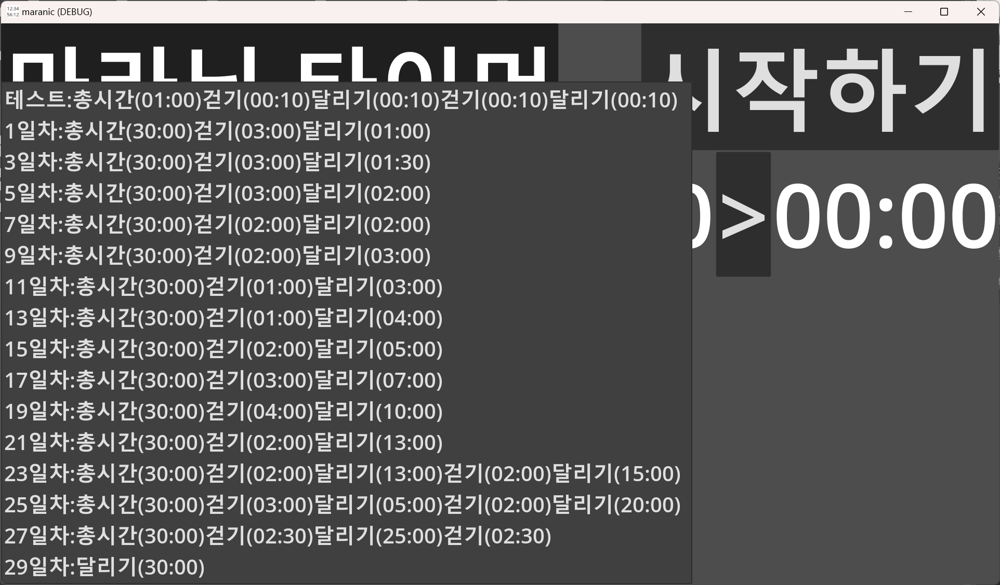
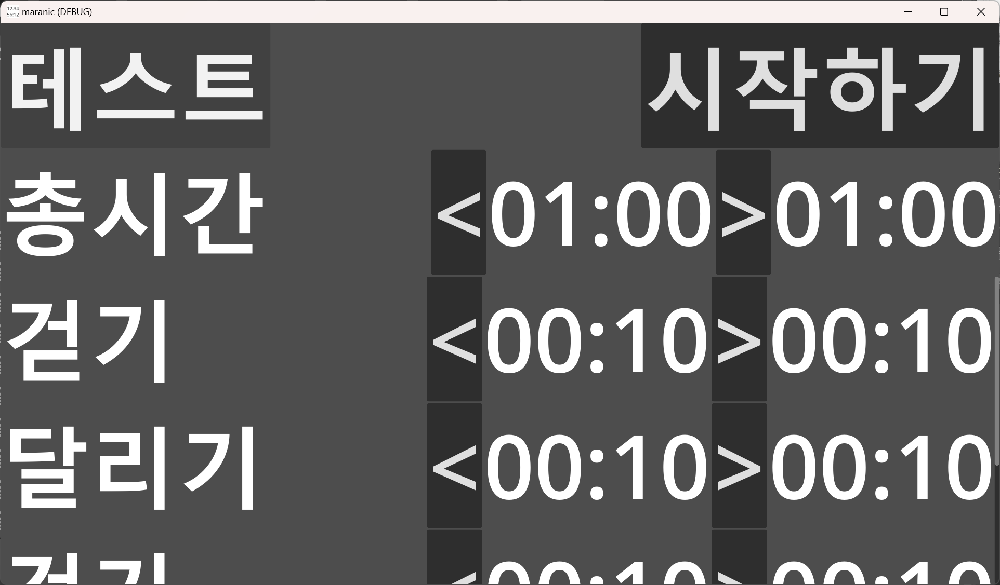

# godot 4.1 로 만든 마라닉TV 30일 훈련용 타이머

https://www.youtube.com/watch?v=rOoYrqdCVc0 를 위한 타이머

실행 동영상 https://youtu.be/wVxW-wJveb4

최초 시작 화면에서 [마라닉 타이머]버튼을 누르면

훈련 목록이 나옵니다.

목록에서 선택을 하면 훈련 화면이 나옵니다.

